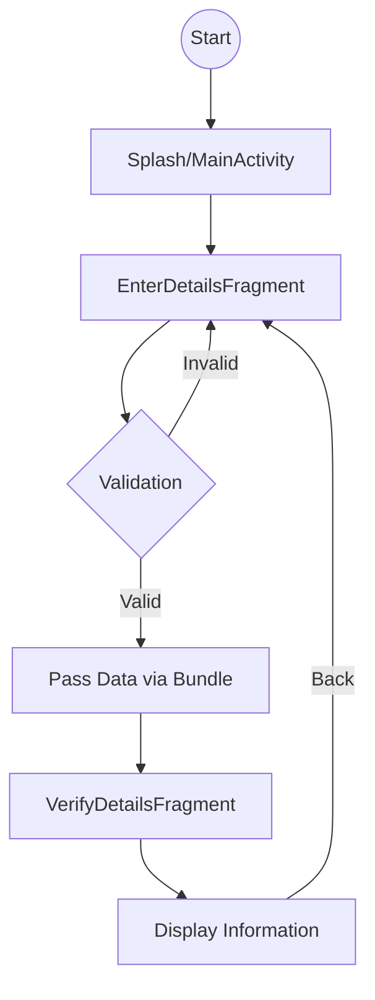
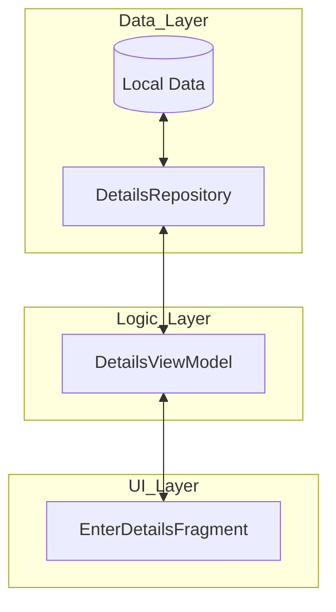

# 🚀 NavigationSimpleDemo | Kotlin & Android Jetpack

<p align="center">
  
  
  
  
</p>

---

## 🌟 Overview
**NavigationSimpleDemo** is a high-performance, education-focused Android application designed to master the **Android Jetpack Navigation Component**. This project serves as a cornerstone for learning how to manage complex fragment transactions, safe data passing, and lifecycle-aware UI components in a modern Android environment.

Built with **100% Kotlin**, this project demonstrates the transition from traditional Activity-based navigation to the modern **Single Activity Architecture**.

---

## 📸 App Showcase

---

## 🛠 Tech Stack & Modern Android Development (MAD)
This project is built using the latest industry standards:

- **Language:** [Kotlin](https://kotlinlang.org/) (Coroutines, KTX)
- **Architecture:** Single Activity Architecture
- **Jetpack Components:**
  - **Navigation Component:** For seamless fragment transitions.
  - **SafeArgs / Bundles:** For type-safe data passing.
  - **Fragments:** Modular UI components.
- **UI Tooling:** Material Design 3, ConstraintLayout.

### 🏆 MAD Score
| Category | Status | Score |
| :--- | :--- | :--- |
| **Kotlin** | ✅ Fully Migrated | 100% |
| **Navigation** | ✅ Jetpack Navigation | 100% |
| **Architecture** | ✅ Single Activity | 100% |
| **UI** | ✅ Material Design | 90% |

---

## 📊 Application Flow
The following flowchart illustrates the user journey and data persistence layer:



---

## 🏗 MVVM Architecture (Conceptual)
While this is a simple demo, the application is prepared for a full **MVVM (Model-View-ViewModel)** implementation:



---

## 🚀 Getting Started
1. **Clone the repo:**
   ```bash
   git clone https://github.com/yourusername/NavigationSimpleDemo.git
   ```
2. **Open in Android Studio:**
   Ensure you have the latest Arctic Fox or Bumblebee version.
3. **Run the app:**
   Select your emulator or physical device and hit `Run`.

---

## 👨‍💻 Learning Objectives
- [x] Setting up a `NavHostFragment`.
- [x] Defining Navigation Graphs (`nav_graph.xml`).
- [x] Navigating between destinations using `NavController`.
- [x] Passing arguments using `Bundle` and retrieving them.
- [x] Overriding `onSupportNavigateUp` for system back button support.

---

<p align="center">
  Developed with ❤️ for Android Education.
</p>
